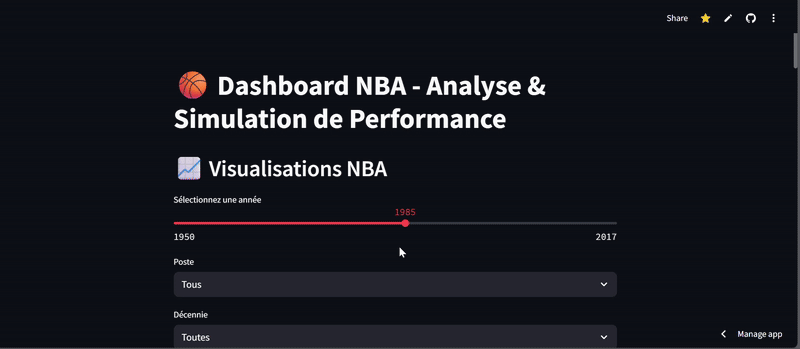
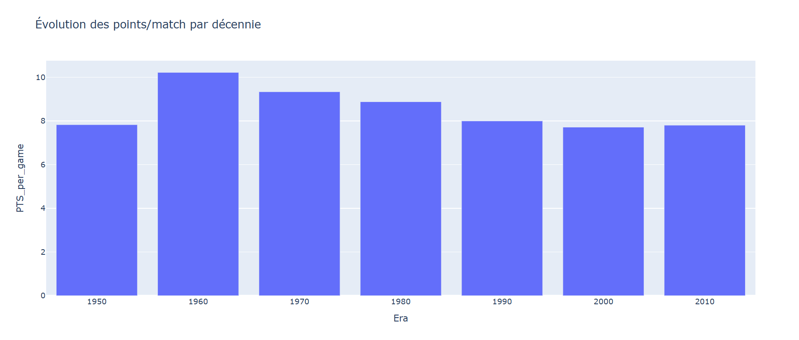

# 🏀 Analyse des Joueurs NBA depuis 1950

## 👥 Membres du groupe
- Afi TENUDA-EKLOU
- Joyce Ashley MASSAH NSANGOU
- Moesha FOTSO

## 📊 Description
Ce projet explore les statistiques individuelles de la NBA depuis 1950. Nous avons analysé l’évolution du scoring, comparé les postes (G, F, C) et construit un modèle simple de prédiction du nombre de points par match selon le profil joueur.

## 📁 Dataset
Données issues de [Kaggle - NBA Stats](https://www.kaggle.com/datasets/drgilermo/nba-players-stats)  
- `Seasons_Stats.csv` : stats saison par joueur
- `Players.csv` : données biographiques des joueurs

## 🚀 Dashboard
Instructions :
```bash
pip install -r requirements.txt
streamlit run dashboard_app.py
# 🏀 Analyse des Joueurs NBA depuis 1950

## 👥 Membres du groupe
- Afi TENUDA-EKLOU
- Joyce Ashley MASSAH NSANGOU
- Moesha FOTSO

## 📊 Description
Ce projet explore les statistiques individuelles de la NBA depuis 1950. Nous avons analysé l’évolution du scoring, comparé les postes (G, F, C) et construit un modèle simple de prédiction du nombre de points par match selon le profil joueur.

## 📁 Dataset
Données issues de [Kaggle - NBA Stats](https://www.kaggle.com/datasets/drgilermo/nba-players-stats)  
- `Seasons_Stats.csv` : stats saison par joueur
- `Players.csv` : données biographiques des joueurs

## 🚀 Dashboard
Instructions :
```bash
pip install -r requirements.txt
streamlit run dashboard_app.py
```

## 🎥 Démo


## 🧠 Résultats clés
- Wilt Chamberlain a dominé les stats avec plus de 50 points/match en 1962
- Les années 60 ont été la décennie la plus productive offensivement
- Les arrières sont les plus gros scoreurs en moyenne
- Notre modèle de régression permet de prédire le scoring avec R² ≈ 0.70

## 📊 Moyenne des points par poste



## 📈 Évolution des points par décennie


## 📦 Outils
- Python, Pandas, NumPy, Matplotlib, Plotly, Scikit-learn, Streamlit
- LLM utilisé : ChatGPT (support structuration & visualisation)
